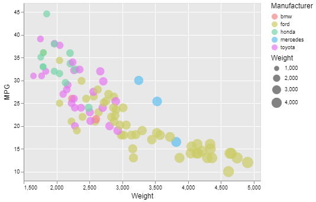

# 02-DataVis-5ways

Assignment 2 - Data Visualization, 5 Ways  
===

- Data positioning: it should be a downward-trending scatterplot as shown.  Weight should be on the x-axis and MPG on the y-axis.
- Scales: Note the scales do not start at 0.
- Axis ticks and labels: both axes are labeled and there are tick marks at 10, 20, 30, etcetera.
- Color mapping to Manufacturer.
- Size mapping to Weight.
- Opacity of circles set to 0.5 or 50%.

Other features are not required. This includes:

- The background grid.
- The legends.

Note that some software packages will make it **impossible** to perfectly preserve the above requirements. 
Be sure to note where these deviate.

Improvements are also welcome as part of Technical and Design achievements.

Tips
---

- If you're using d3, key to this assignment is knowing how to load data.
You will likely use the [`d3.json` or `d3.csv` functions](https://github.com/mbostock/d3/wiki/Requests) to load the data you found.
Beware that these functions are *asynchronous*, meaning it's possible to "build" an empty visualization before the data actually loads.

- *For web languages like d3* Don't forget to run a local webserver when you're debugging.
See this [ebook](http://chimera.labs.oreilly.com/books/1230000000345/ch04.html#_setting_up_a_web_server) if you're stuck.

Readme Requirements
---

A good readme with screenshots and structured documentation is required for this project. 
It should be possible to scroll through your readme to get an overview of all the tools and visualizations you produced.

- Each visualization should start with a top-level heading (e.g. `# d3`)
- Each visualization should include a screenshot. Put these in an `img` folder and link through the readme (markdown command: ``.
- Write a paragraph for each visualization tool you use. What was easy? Difficult? Where could you see the tool being useful in the future? Did you have to use any hacks or data manipulation to get the right chart?

Other Requirements
---

0. Your code should be forked from the GitHub repo.
1. Place all code, Excel sheets, etcetera in a named folder. For example, `r-ggplot, matlab, mathematica, excel` and so on.
2. Your writeup (readme.md in the repo) should also contain the following:

- Description of the Technical achievements you attempted with this visualization.
  - Some ideas include interaction, such as mousing over to see more detail about the point selected.
- Description of the Design achievements you attempted with this visualization.
  - Some ideas include consistent color choice, font choice, element size (e.g. the size of the circles).

**NOTE: THE BELOW IS A SAMPLE ENTRY TO GET YOU STARTED ON YOUR README. YOU MAY DELETE THE ABOVE.**

# R + ggplot2 + R Markdown

According to the original README.md for this assignment:
`R is a language primarily focused on statistical computing.
ggplot2 is a popular library for charting in R.
R Markdown is a document format that compiles to HTML or PDF and allows you to include the output of R code directly in the document.`

I have found trying to figure out how to do stuff in R frustrating, but since the original chart was created in ggplot2, I was able to recreate it almost identically with minimal code.

I borrowed code from the following sources:
- This class: https://wpi0-my.sharepoint.com/personal/ltharrison_wpi_edu/_layouts/15/onedrive.aspx?id=%2Fpersonal%2Fltharrison%5Fwpi%5Fedu%2FDocuments%2FSpring%202022%2Fcs480x%2D22c%2Fvid%2F2022%2D01%2D24%2013%2E03%2E11%20cs480x%2D22c%2Fggplot2demoinclass%2Ezip&parent=%2Fpersonal%2Fltharrison%5Fwpi%5Fedu%2FDocuments%2FSpring%202022%2Fcs480x%2D22c%2Fvid%2F2022%2D01%2D24%2013%2E03%2E11%20cs480x%2D22c
- https://www.datanovia.com/en/blog/how-to-remove-legend-from-a-ggplot/
- https://statisticsglobe.com/set-legend-alpha-of-ggplot2-plot-in-r
- https://www.tutorialspoint.com/how-to-import-csv-file-data-from-github-in-r

# d3...

(And so on...)

# Vega-Lite

"Vega-Lite is a high-level grammar of interactive graphics", according to Vega-Lite's website.

It allows us to easily create charts in JSON. The object structure can match data structures to various properties of the markers, and legends and axes are automatically created for each mapping.

Interestingly, according to the documentation, Vega-Lite uses d3 behind the scenes.

When recreating the chart, I used custom colors to match the original, but there are a number of color presets that can be used.

I was unable to match the circle size (mine are generally bigger), and Vega-Lite doesn't support having extra gridlines between axis labels.

# gnuplot

"Gnuplot is a portable command-line driven graphing utility for ... many ... platforms."
 
Gnuplot is at least as beginner unfriendly as R, and Google was much less helpful for finding answers as it was for R. As a result, I gave up before attempting to add the grid or legends.

In addition to the official documentation (http://gnuplot.info/docs_5.4/Gnuplot_5_4.pdf), I consulted these sources:
- https://stackoverflow.com/questions/29071421/gnuplot-plotting-points-with-color-based-iris-data
- https://stackoverflow.com/questions/14871272/plotting-using-a-csv-file
- https://tipsfordev.com/in-gnuplot-how-can-i-plot-the-sum-of-two-columns-when-i-m-plotting-by-header-name
- https://courses.physics.illinois.edu/phys466/sp2013/comp_info/gnuplot.html (for how to load scripts)

There are ways to use gnuplot online; however, with the way I installed it, it doesn't support using online files. You will need to put gnuplot.script and cars-sample.csv in the same folder to get the code to run.

# Excel

Excel is a part of Microsoft Office, and deals with spreadsheets.

Among its features is the ability to create charts and graphs.

I have already learned a large number of Excel's features due to having previously taken a course in Office, and so it didn't take that long to create the chart.

Excel doesn't support mapping a data series to color; however, because the data series that was mapped to color was categorical, I was able to use it to filter the data into 5 groups, each of which I graphed using a different color.

Excel also doesn't support mapping a data series to size, nor changing the spacing of axis ticks or gridlines.
Furthermore, it added about 400 FALSE/FALSE datapoints (which were artifacts of my filtering method) to the graph at (0,0), forcing the graph to include the origin.

Like Vega-Lite and ggplot, Excel uses builtin color palletes, but I used a custom pallete to match the original graph.

## Technical Achievements
- **Probably none**

### Design Achievements
- **Probably none**
